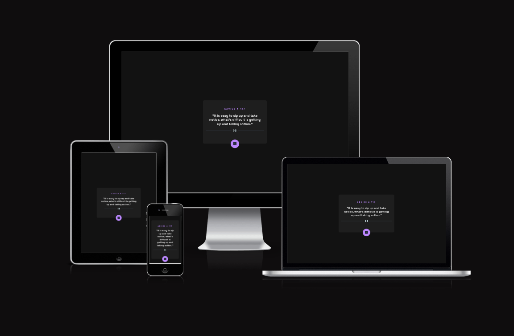

# Advice Generator App 💙

Oláa! Sou **Jaqueline Gotardi** 👋

Este projeto é um **gerador de conselhos** que consome uma API externa e atualiza o conteúdo dinamicamente. Ele foi desenvolvido como **exercício do curso DevQuest, da Dev em Dobro**, focado em **Front-end**.  

O que eu mais amei nesse exercício foi poder **resolver tudo sozinha**, explorando JavaScript assíncrono, consumo de API e animações simples no DOM. Um ótimo treino de lógica e interatividade! 🚀



---

## ✨ Funcionalidades

- 🎲 Exibe um conselho aleatório a cada clique no botão  
- 🌐 Consome a API [Advice Slip](https://api.adviceslip.com/)  
- 💫 Animação suave ao atualizar o conselho  
- 📱 Layout responsivo e moderno  

---

## 🛠 Tecnologias

- HTML5;
- CSS3;
- JavaScript;
- Fetch API (async/await); 

---

## 🚀 Como usar

1. Clone o repositório:  
```bash
git clone https://github.com/seu-usuario/advice-generator-app.git
```
2. Abra o arquivo index.html no navegador;
3. Clique no botão 🎲 para gerar novos conselhos;

---

## 💡 Observações:
Exercício super prático para Front-end, perfeito para treinar manipulação do DOM, consumo de APIs e interatividade com o usuário.

Projeto com layout moderno, responsivo e divertido...

---
**Feito com 💙 por Jaqueline Gotardi**

#DevQuest #FrontEnd #JavaScript #ProjetosDeVida #AprendizadoConstante #MinhaJornada.
